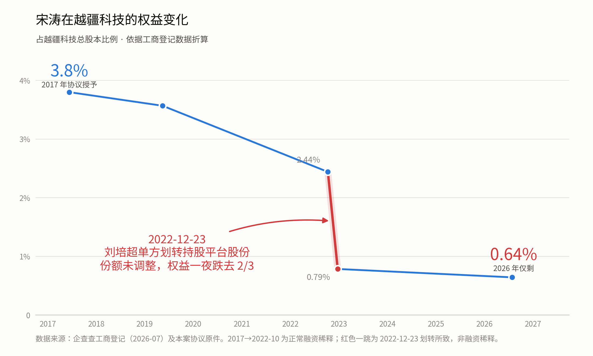

# 从越疆科技股权争议，聊聊打工人手里的期权

*【作者按】从最初签下一纸协议，到最终结束一段长期的合作，期权的兑现往往比我们想象的要复杂得多。下文梳理了近期几起公开的股权争议事件，信息均来自公开渠道与当事人自述。写下这些，并非为了给出法律裁判，而是希望能为所有手里正攥着期权的人，提供一份清醒的防坑指南。*

---

## 一、今天，是宋涛

2026 年 7 月，越疆科技前常务副总/COO 宋涛连发数文，实名举报越疆科技（已在港交所上市，正冲刺A股创业板）及其创始人刘培超。举报函、协议、裁判文书，材料很多，但这件事核心就是**三句话**：

> **2017 年，公司白纸黑字承诺给他总股本的 3.8%；**
> **2026 年，工商登记里折算到他名下的，只剩 0.64%；**
> **而就连这 0.64%，公司也起诉要求收回——开价 139.46 万元，不到这些股份市值的 3%。**

给了，缩了，最后连零头也要拿走。

第一句，来自这份协议——2017 年 6 月 12 日，宋涛与越疆签署的《股权授予协议书》第 1 页，甲方是深圳市越疆科技有限公司、法人刘培超，乙方是宋涛（原件由宋涛在其公众号"宋涛机器人"公开）：

这一页把几件事写得清清楚楚：

- **身份**：*"因公司发展需要，甲方欲引进乙方为公司**常务副总/COO**，负责公司的运营及管理等相关工作"*；
- **给多少**：甲方同意授予乙方**公司总股本的 3.8%**，分三期支付；
- **什么时候给**：第一期为授予股的 **40%**，*"入职后壹个月内完成支付"*，第二期 40% 入职后第二年内完成支付；第三期 20% 入职后第三年内完成支付；
- 还有一条容易被忽略、其实埋着雷的：*"若支付期间存在股权稀释的情况，则前述授予股同比例稀释"*。

份额、节奏、条件，白纸黑字，签字盖章。这是 2017 年的承诺。（那条"同比例稀释"里埋着的雷，第三节再拆。）

先把一个用词说清楚：宋涛这份是白纸黑字的**股权授予**，后来落成持股平台的合伙份额——严格说不是"期权"。但它和期权面对的是同一道坎：**承诺的权益，最后能不能兑现。**本文说"期权"，取的是打工人语境里的广义；这层区别在第三节还会用到。

第二句，是把此后九年的工商登记数据连成一条线：

**这条线要分两段看，性质不同。**

前一段，2017 到 2022 年，3.8% 缓缓滑到 2.44%。这是正常的融资稀释：公司融资、新投资人进来，**所有股东按同一比例一起变小**——协议里"同比例稀释"说的就是这个。这段稀释宋涛认，任何拿期权的人都得认。到这里为止，一切正常。

然后是那道**红色悬崖**：2022 年 12 月 23 日，一天之内，2.44% 跌到 0.79%，**跌去三分之二**。

这一天，公司没有融资，没有新投资人进来。发生的事情是：在宋涛离职一年多后，他所在持股平台的执行事务合伙人——刘培超——把平台持有的越疆公司股份中的大部分，划转到了两个新设的持股平台；而宋涛在原平台里的份额比例，**没有做相应调整**。打个比方：**蛋糕被端走了三分之二，而你手里那张写着比例的分蛋糕券，还是原来那张。**

（至于悬崖之后那一小段：0.79% 到 0.64%，是 2024 年底越疆港股上市发行新股及前后增资带来的正常摊薄——和前一段一样，所有股东同比例承担，没有争议。真正需要解释的，只有中间那一跳。）

读到这里你可能会想：份额该不该调、该调成多少，恐怕是笔糊涂账——员工一个说法，公司一个说法，各执一词，外人没法断。

但这个案子，偏偏留下了一份文件。2023 年 1 月 28 日，划转一个多月后，持股平台向宋涛发出**盖章的《说明函》**：告知了这次划转，写明调整份额的目的是*"使越疆合伙原合伙人在接受股权激励时所间接持有的越疆公司注册资本保持不变"*，并在表格里列明宋涛变更后的财产份额为 **6,973.73 元（合伙总额 10,000 元）——折算即 69.7373%**（函末另有备注，称该邮件及后续工商变更"不代表……无争议"，越疆可据此主张这只是过渡安排）。请注意这份函的分量——**要让宋涛的权益维持不变，份额应该调到多少：这道题，平台自己算过，答案自己写过，章自己盖过。**

然后呢？当年年底（2023 年 12 月）的工商变更里，他名下登记的，依然是 **22.455%**。而把《说明函》的表格和工商登记并排放，还有一个更扎眼的对照：**函上写着，刘培超变更后应持份额 0.279%；工商登记里，他名下是 53.067%**——宋涛主张本应归他的那 47.2823%，恰好落在这个差额之内（越疆对此否认）。

然后是开头的第三句话——**连剩下的这 0.64%，公司也要收回去。**

2024 年 3 月，越疆把宋涛告上法庭，诉求是：确认他名下份额自离职之日（2021 年 3 月）起失效，并以 **139.46 万元**转让给刘培超。

就在**同一年的 12 月**，越疆在港交所挂牌——**按公司自己定的 IPO 发行价（18.8 港元）计算，这部分份额市值约 5300 万港元，139 万不到份额市值的 3%**。而且这个价格不是"起诉时还没上市"的旧开价：官司一审、二审、再审三轮都因"双方约定了仲裁"被驳回，走完这三轮时公司已上市近一年，**139.46 万的主张原封未动**。若按 2026 年 7 月的股价算，这部分份额市值约 **7000 万港元**，139 万约合其 **2%**。

也就是说，无论拿哪个时点的价格作参照——公司自己的发行价，还是今天的市价——**这个回收价都不到份额市值的 3%**。还要注意：三轮驳回都只停在"该去仲裁"的程序门槛上，未作实体审理；股权到底归谁，至今没有任何法院给出过结论。

三句话合在一起，就是宋涛的处境：**协议承诺的权益，九年间缩水了六分之五；缩水的大头，不是来自市场，而是来自一次他无法阻止的划转；而剩下的零头，公司还想按不到市值 3% 的价格拿回去。**

需要说明的是：69.7373% 应归谁，是宋涛的主张，越疆科技已公开回应称其举报"不属实且存在严重误导性"，最终以仲裁及监管结论为准。但上面那条线里的每一个点——3.8% 的协议、22.455% 的登记、《说明函》表格里的 6,973.73 元与 27.90 元、划转的日期、139.46 万的诉求——都出自协议原件、盖章函件、工商档案和法院文书，**不是任何一方的说法**。

换句话说，双方争的不只是**"该给多少"**，还有**"人走了之后，已经给的还算不算数"**——后面这个问题，恰恰是每一个拿期权的人都可能遇到的。

至于结果：7 月 22 日，越疆的创业板首发已获深交所上市委审议通过。举报没能改变结果，但却把这件事推到了台面上。

这件事剥开"高管""上亿股权"这些标签，它的内核，其实是很多优秀打工人可能遇到的处境：

**一个人陪公司走了多年，想完全拿到自己那一份股份，却发现这远比想象中困难。**

---

## 二、筹码最硬的人，都走到了公开发声这一步

你可能会说：他是 COO、是公司最早的一批人，那是大人物之间的纷争，跟一个普通人有什么关系？

恰恰相反：**级别越高的人都遇到了困难，越说明这件事和级别无关。** 一位 COO 手里的筹码、请得起的律师、对公司的了解，都远多于普通员工——如果连他都要走到公开发声这一步，那我们更应该早一点了解这里面的规则。

而且这样的事，并不少见。就在上个月，另一家公司的前员工陈浩，同样在小红书冲刺 IPO 的节点上公开发声——他两年多维权的全过程，都记录在公众号"汉特CHEN"里。而他与公司的那场官司，早在此之前就已走完全部程序：广州两级法院认定公司违法解除劳动合同，期权损失部分也获得了赔偿——法院在裁判中明确了一个重要逻辑：**期权与劳动关系绑定，属于劳动报酬的延伸，不是公司可以随意收回的"福利"。**

同样在这个月。7 月 24 日，张帆在公众号"耕者之辛"发文维权。据其自述，她的身份很特别：360 赴美上市时的美国法律顾问，后来放弃律所合伙人身份全职加入，做到 360 回归 A 股后的首任董事会秘书兼首席法律顾问——招股书出自她手，私有化和借壳上市她全程参与。她称自己持有 201.6 万股股权激励权益，离职七年、持股平台清仓减持五年，至今一分钱未收到；今年 7 月她给公司实控人发微信沟通，被拉黑。她已委托律师发出律师函，索要约 2649 万元及利息。7 月 30 日，360 回应称：当年的激励规则正是由张帆本人主导设计，公司支持她依法解决争议。**这个回应本身就值得玩味：连公司都确认规则出自她手——而规则的设计者要拿回自己的那份，走到今天用的是发文和律师函。**

**一个亲手写下这套规则的人，最后也要靠公开发文，才能让人听见自己的诉求。**

一位 COO，一位法院已经判他赢了的前员工，一位亲手写过招股书的董秘——手里的筹码一个比一个硬，却都走到了公开发声这一步。问题显然不在他们身上，而在他们共同面对的那套机制里。而这套机制不在别处——**它很可能就躺在你自己签过的那份协议里。**

---

## 三、为什么你"有股权"，却不一定"拿得到钱"

这是全文最需要你记住的一点：**"我有期权"和"我能变现"，是两件完全不同的事。**

上市前，你的期权／股权，绝大多数不是直接登记在你名下的公司股票，而是放在一个叫"**持股平台**"（通常是有限合伙企业）里。你是这个平台的**有限合伙人（LP）**，而**普通合伙人（GP）——也就是实际拍板的人——往往就是老板或他控制的主体。** 通俗点说：**股份是你的，方向盘是他的。**

这个结构本身是合规工具，没有原罪。但它天然造成了三个"不对称"，你必须心里有数：

**第一，定价权不对称。** 未上市公司的股权没有市场价。如果公司要回购你的份额，"合理对价"怎么算？现实中，估值报告是公司委托、公司付费出具的，员工几乎没有议价的抓手。

**第二，稀释权不对称——这里埋着第一节说的那颗雷。**

回头看宋涛那份协议里的话：*"若支付期间存在股权稀释的情况，则前述授予股同比例稀释"*。大多数人读到这句，理解的是**融资稀释**——公司后续融资、新投资人进来，大家按比例一起被稀释，自己那 3.8% 慢慢变成 3%、2%。这很公平，也是常识。

但这句话没有说清楚的是：**稀释是在哪一层发生的。**

一旦股权被放进持股平台，除了"公司层面"的融资稀释，还可能有"平台层面"的变动——平台内部的份额调整、股份划转。**打个比方：融资稀释，是新投资人带着真金白银进来，蛋糕变大了——你的那一份没有变，只是占整个蛋糕的比例变小了；而这件事人人平摊，老板的比例也一样在变小，谁也不吃亏。平台层面的变动则不同——蛋糕并没有变大，你盘子里的那一块，却可能被直接切走一部分，摆进别人的盘子。** 两层叠加，结果可能和你签字时理解的完全不是一回事。宋涛这场争议的核心情节之一，正是他主张持股平台的份额被单方划转、稀释（越疆对此否认）。

更值得注意的是：那份 2017 年的协议对持有形式只有一句话——*"乙方通过持有甲方员工持股平台（有限合伙企业）对应的财产份额间接持有公司股权"*。**平台这一层怎么运转——份额怎么调、划转要不要经你同意、谁来拍板——协议一个字都没有。**当年签字认下的只是"同比例稀释"和"通过平台持有"，而真正决定命运的平台治理规则，全部留在了未来。

（平台层面的操作是否需要每一位 LP 逐一同意，取决于合伙协议怎么写——而合伙协议，通常也是公司起草的。）

**第三，信息权不对称。** 签什么、什么时候签、哪一版有效、公司给不给你留存一份，文书的主动权大多在公司。

把这三个不对称加在一起，结论就很清楚了：**上市之前，你那份股权值多少、能不能拿走，很大程度上不取决于协议上的数字，而取决于对方的意愿和你手里的凭据。**

而且这道坎并不随上市自动消失——只要你的名字还挂在持股平台里、而不是自己的股票账户里，这三个不对称就一个都没解除。越疆上市之后，照样起诉要收回宋涛的份额；360 上市多年、平台早已清仓变现，而据张帆公开陈述，她至今一分未收。**上市，改变的只是股份的价格，不是你能不能拿到它。**

---

## 四、最危险的，是那句"熬到期就是我的"

很多员工有个朴素的安全感："我协议白纸黑字写了分三期、四期归属，我熬到期，它就是我的。"

理想很美好。但现实里，想让这份安全感落空，公司甚至不需要违约——**三种"软处理"，足够了：**

- **拖。** 到期了不主动给你办手续，你不追，它就一直挂着。能挂多久？张帆的答案是：离职七年，平台清仓五年，至今还挂着。
- **换协议。** 用"持股平台规范化""为了 IPO 合规"这类听起来很正当的名义，请你签一份新协议——而新协议里，已经到期或即将到期的份额，可能被重新设定了锁定条件。名义是规范，效果是给你的激励重新上了一把锁。
- **议价。** 就算同意回购，按什么价格回购，主动权也在公司一侧。

还有一种更需要警惕——**在你没有充分注意的情况下，签下对自己不利的补充协议等文件。**

公司慢慢大了，文件越来越多。不妨想象这样一个场景：某个工作日的下午，HR 或行政的小姐姐抱着一摞文件匆匆走到你工位——她今天要收齐几十个签名，你只是其中一站。文件直接翻到最后一页，签字线上贴着小标签，她指了指："公司决议，走个流程，今天要收齐的。"她显然也不清楚里面写了什么，语气公事公办，没有半点恶意，眼神里只有"下一位"。这时候说"我要把全本拿回去研究两天"，仿佛是在故意刁难一个无辜的传话人——多不好意思啊。于是你笑了笑，签了。前后不到二十秒。

可就在这二十秒签下的"流程"里，可能藏着变更锁定期、确认"自愿放弃"之类的条款。**真正让你放下防备的，从来不是什么骗术，是不好意思。** 递文件的人越无辜、越着急、越例行公事，你就越张不开嘴较真——而这份"不好意思"，恰恰是各种签字流程里最好用的润滑剂。

所以，请守住几条朴素的底线——**无论对方给出什么理由**：

1. **看清楚再签。** 没看明白，就要求把文件拿回去，研究完再签。不要怕签字同事或公司觉得你"小气""不信任公司"——一家值得托付的公司，不会连"让员工看清自己要签的东西"都不答应，毕竟签了字，负责的是你自己。对方对"较真"的反应，本身就是一块试金石。
2. **只递签字页的，必须看到全本。** 你签的是整份文件，不是最后一页。每一页都翻过，再落笔。
3. **落款日期必须真实。** 凡是让你"补签"、把日期倒填到从前的文件，都要打起十二分精神。日期决定归属从哪天起算、几份协议谁先谁后、证据链成不成立——倒填一次日期，可能就是亲手改写了自己的时间线。
4. **签过的每一份，都要留存一份。** 连员工自己签字的协议都不提供一份给员工的"协议"，大概率就不是"走个流程"。

---

## 五、老板的心态，是怎么一步步变的

机制之外，还有人心。很多亲历者会告诉你：老板不是一开始就这样的——恰恰相反，一开始好得让你没法拒绝。

**拿到大额融资之前，创始人往往是全公司姿态最低的人。** 他缺钱、缺人、缺背书，你就是他此刻最需要的人。这个阶段他可以对你好到超出想象：三顾茅庐、称兄道弟、工资谈不拢就谈股份，把未来讲得让你热血沸腾。宋涛在公开自述里说，他当年放弃华为百万年薪，就是被"师兄"一口一个地叫着、掏心掏肺劝进越疆的。这样的场景，在很多创业公司的早期都真实发生过：创始人省吃俭用，出差住便宜的酒店，和大家一起在办公室熬到深夜。

那个阶段的承诺，当时或许是真心的。**但真心与否其实不重要——重要的是，在公司生死未卜的早期，股份价值并不高，承诺成本低**——慷慨并不费力。

**拿到大额融资之后，天平开始倾斜。** 钱到账，估值起来了，当年那些低成本的承诺，变成了让人心惊肉跳的价格。这时候，创始人的心理账本会发生一次隐秘的重算：他记住的，是你入职时的薪水和当年的贡献；他看到的，是你手里份额按新估值折算出来的天文数字。两相对照，一个念头几乎不可避免地冒出来——**"给多了。"**

于是行为开始变化，而且路径惊人地相似：

- **引入"更强的人"。** 高薪从大厂挖来新高管——补短板是真的，稀释老人的权力和话语权，也是真的。会议室里创始人和一帮兄弟原本平等的讨论，慢慢变成"对齐""赋能"和心照不宣的恭维。
- **重排身份序列。** 一起修路筑墙的战友，在新的组织叙事里变成"历史贡献者"——翻译过来就是：性价比不高的资产。
- **处理"历史遗留问题"。** 当年大方给出的承诺，如今成了报表上的成本、上市前的"不确定因素"，于是有了各种"规范化""调整""重新签署"。

这不是某一个人的问题，而是一道几乎所有创始人都要面对的考题：**当一份当初廉价的承诺变成天文数字，兑现它所需要的品格，远比做出它时需要的多。** 绝大多数人一生没有经受过这种测试，你也无法提前知道你的老板能不能通过。

所以给打工人的启示很简单：**不要用融资前的老板，去预测融资后的老板。** 真正值得参考的，是他在利益面前的历史记录——而这，正是下一节几个正面例子的价值所在。

---

## 六、换个方向：好的老板，是什么样的

讲了这么多"坑"，你可能会觉得沮丧。但我想特别说清楚：**这不是股权激励本身有问题，而是有的人把承诺当承诺，有的人不。** 做得好的老板和公司是存在的，值得当成择业的参照系。先把边界说清楚：下面提到的公司没有一家是完美样本，**本文只取一个切面——创始人对待员工股权的态度**，切面之外的功过不在讨论范围。

**把时间拨回更早——"把利益分出去"，在中国商界早有先例。** 上世纪八十年代末万科股份制改造，创始人王石放弃了本可属于自己的大额股权，只做职业经理人，理由是八个字——**"财散人聚，财聚人散。"** 任正非则把"分钱"做成了制度：华为绝大部分股份由十几万员工通过工会持有——严格说，员工拿的是虚拟受限股，是分红与增值的权益，不是登记在自己名下的股权；这套结构放在治理失序的公司，恰恰就是本文警惕的那种"股份是你的、方向盘是他的"。华为把它撑住靠的不是结构，而是几十年的兑现纪录：他本人只留不到 1%，每年把利润实实在在地分下去，从不打折。两人做法不同，但有一个共同点，也正是本文关心的那条线：**给出去的，就是员工的。** 几十年过去，没有谁掉过头来说当初那份"其实不该给"、要按零头收回去。

这样的先例，今天依然有人在续写。就在本文写作的这一周——2026 年 7 月 27 日，国产 DRAM 厂商长鑫科技登陆科创板，首日市值一度突破 3 万亿元。比市值更值得看的，是招股书里的两件事。其一，公司的两期员工持股计划自 2021 年起持续实施，截至招股书签署日已累计授予 **6760 人次**——这是已经发生的存量激励。其二，创始人朱一明承诺，把自己获授股份的一半——约 **7.68 亿股**——在上市后 10 年内，以现金或股份形式全部分配给员工（不含本人），且不新增股份、不稀释原有股东；他同时承诺上市后第一个十年一股不减持。这份承诺兑现得并不快（自上市满 36 个月起分阶段实施），但对比恰恰在这儿：**同样是走到上市这一天，有的公司在起诉离职员工、按市值零头回购；而这里，创始人把自己一半的股份写进招股书，许给了员工。** 兑现得慢，和压根不想兑现，是两回事。

类似的例子还有：字节跳动在未上市期间定期回购老员工股票，工程师郭宇因此在 28 岁就把纸面期权变成了真金白银；MiniMax 创始人闫俊杰在 2026 年 7 月公司股票解禁、股价波动之际，宣布从个人股份中拿出 4% 激励团队、1% 支持开源；胖东来的于东来把约 38 亿元资产对应的收益，按公开标准分给一万多名员工，自己只留 5% 左右。做法各有可议之处，但方向是一致的——**分给员工的，是真分。**

> **好的股权文化，是把当初的承诺当成要兑现的债；坏的股权文化，是把当初的承诺当成上市前要甩掉的包袱。**

你要做的，是在入职、签字、观察老板言行的过程中，尽早分辨出你在的是哪一种。

---

## 七、太平洋对岸：硅谷是怎么处理这件事的

一个自然的问题：这是全世界创业公司的通病，还是我们这里特有的玩法？答案是：**人性哪里都一样，但规则的"默认值"不一样。**

**第一个不同：归属了，就是你的。** 硅谷的标准做法是"四年归属、一年悬崖"：干满一年拿到四分之一，之后逐月归属。关键在于——**已归属（vested）的部分，是你的财产，不是老板的恩赐**，离职带走是默认设置（严格说，期权还有"离职后 90 天内自费行权"的门槛，那是另一重坑；但已归属的权益本身，公司无权单方收回），不存在"上市前离职一律收回"。一个例子是 Ilya Sutskever：他是 OpenAI 联合创始人，也是 2023 年底带头投票罢免 CEO 奥特曼的人。他 2024 年 5 月离职，股份原封不动地带走，几周后创办了自己的新公司；2026 年他出庭作证时披露，所持 OpenAI 股份价值约 70 亿美元。**带头罢免 CEO 的人离职，股权照样是他的——这就是行业"默认值"的差距。**

**第二个不同：出了事，纠错很快。** 硅谷不是天堂。2024 年 5 月，OpenAI 就被媒体曝出离职文件里藏着"不签不贬损协议，就可能失去已归属股权"的条款——你看，想收回员工到手股权的冲动，哪里的老板都会有。但报道发出后全网哗然，奥特曼几天内公开道歉，写下那句被广泛引用的话——**已归属的股权就是已归属的股权，这点毋庸置疑（vested equity is vested equity, full stop）。** 条款随即删除，公司承诺不追回任何人的股权。差别不在人性，而在行业共识和舆论的压力，能让公司在几天内自我纠错。

**第三个不同：不用熬到上市才能变现。** SpaceX 大约每半年组织一次要约收购（tender offer），员工可以把已归属股份的一部分换成现金；Stripe、OpenAI 也做过大规模的同类安排。**"没上市就是废纸"，在那套体系里根本不成立。** 前面说的字节定期回购老股，学的正是这一套。

所以这一节的结论不是"外国的月亮圆"，而是一句更冷静的话：**期权制度的灵魂不在协议文本里，而在公司的默认值里——"归属了就是你的"，在治理健康的公司，是入职那天就写好的起点；在失序的公司，却成了要员工费尽周折也很难争取到的东西。**

---

## 八、给大家的几条自查清单

不需要你变成法律专家，但下面这几条，成本很低，关键时刻能帮上大忙：

1. **签之前，花点钱找律师看一眼——而且要找做股权的专业律师。** 不是通用的法务朋友，是真正处理过股权激励、持股平台、回购条款的那种。这笔咨询费，相对你可能拿到（或失去）的东西，便宜得不成比例。说句掏心窝的话：**这不是我从书上看来的道理，我自己在这件事上，吃过不少亏。**
2. **签字时，守住第四节说的那四条底线**：看清楚再签、看到全本、日期真实、拿到副本——无论对方给出什么理由。
3. 定期在**天眼查、企查查**上看看自己公司的持股平台。如果结构、份额出现你不知情的变动，要提高警惕。
4. 一旦看到"**重新锁定**""**转入持股平台**""**补充协议**""**自愿放弃**"这类字眼，立刻清醒：这是信号，不是流程。
5. **留痕。** 重要的沟通尽量落到邮件、聊天记录上。很多事做过就有痕迹，痕迹在关键时刻就是你的底牌——宋涛也好、陈浩也好，能站出来说话，靠的都是手里那些留过痕的东西。
6. **发现苗头，尽早交涉，谈不拢就尽早止损。** 发现问题不是坏事——最贵的从来不是发现得早，而是发现得晚。犹豫的成本，往往比那份股权本身还贵。**别让最好的年华，枯萎在不值得的地方。**

---

## 九、写在最后

宋涛的仗还没有打完，仲裁与监管的程序仍在继续。但这件事摆到台面上的那个问题——**一家公司在上市前，怎么对待陪它一路走来的自己人**——值得每一个手里攥着期权的人，认真看一眼。

擦亮眼睛，不是要以最坏的恶意去揣测每一位老板。恰恰相反，正因为世上真有王石、任正非那样的先例，真有郭宇的字节、朱一明的长鑫、闫俊杰的 MiniMax，我们才更该有分辨的能力——把好的公司认出来，把值得的人跟对。

再把视野拉开一点。科技自强之路上稀缺的不止是钱，更是愿意把最好的年华，押在一家家前途未明的公司上的人们。期权这个制度，本来就是为此发明的社会契约：它让普通人敢于同行，让公司在发不起高薪的时候，还能请到优秀的人才。

而这份契约，并不只是公司与员工之间的私约。《专利法》第十五条白纸黑字写着，国家鼓励"采取股权、期权、分红等方式"，让创新者"合理分享创新收益"；二十届三中全会《决定》提出，允许更多符合条件的国有企业以创新创造为导向，"在科研人员中开展多种形式中长期激励"；二十大报告说，"尊重劳动、尊重知识、尊重人才、尊重创造"。把这些话翻译成普通人听得懂的一句就是：**让创造价值的人分享价值，不是哪家公司的恩赐，而是国家写进法律和文件里的方向。**

所以，一份期权协议兑不兑现，从来不只是一家公司的家务事。一家公司认下当年的承诺，是在给这份契约加固；每一次成功的违诺，则是在给全社会的信任加税：下一个宋涛只要现金，下一个张帆不再放弃律所合伙人。而信任一旦收缩，最先失血的，恰恰是最需要人才押注的科技。财散人聚，从来不只是某位老板的美德，它是国家想造出自己的芯片、自己的大模型时，必须写进底层的规则。

而这篇文章的最后，不是写给公司的，是写给正在围观的你。规则的默认值，从来不是天上掉下来的，是一次次围观、一次次较真，硬生生顶出来的。**今天你为宋涛停留一分钟，也是为我们自己停留。**

---

*文中三位当事人的原始材料与自述，分别发布于公众号"宋涛机器人"（宋涛）、"汉特CHEN"（陈浩）、"耕者之辛"（张帆），读者可自行查阅核对。*

*涉越疆科技的内容系宋涛单方主张，公司已公开否认；涉三六零的内容，核心系张帆单方公开陈述，360 已于 7 月 30 日回应称激励规则系其本人主导设计、支持其依法解决争议——均以司法、仲裁及监管结论为准。本文不构成法律或投资建议。*
