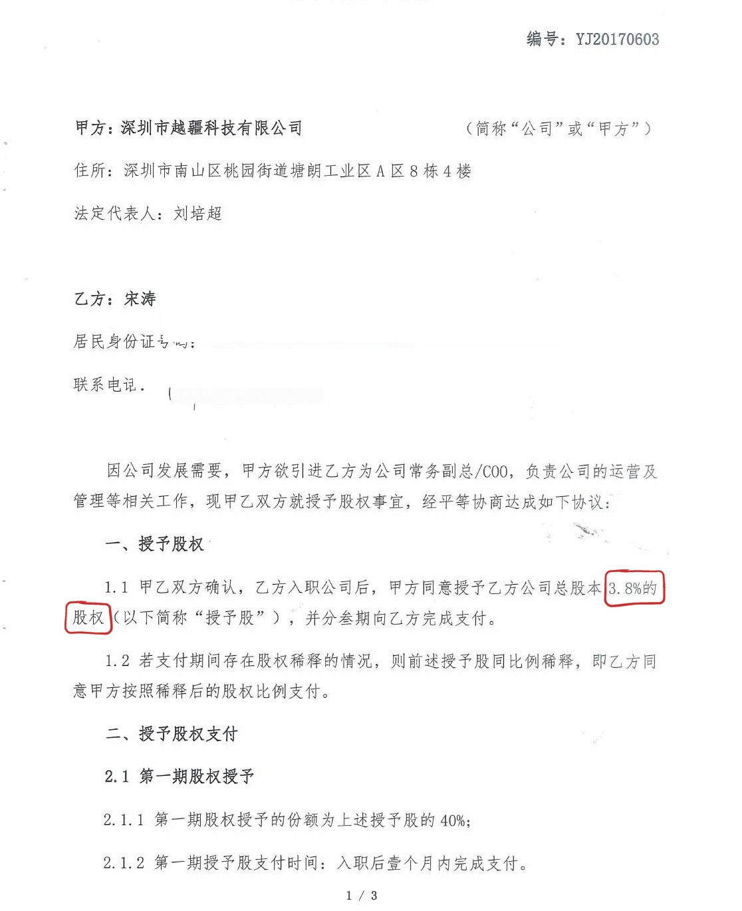
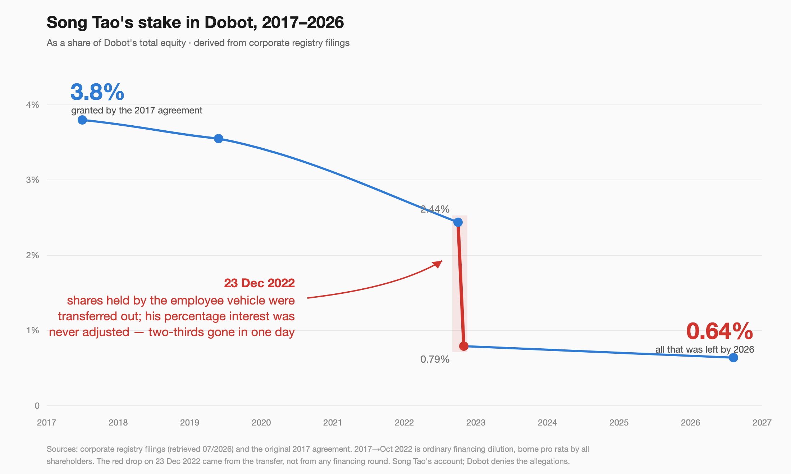

# Today It's Song Tao, Tomorrow It Could Be You — What the Dobot equity dispute says about the options in your own pocket

*[Author's note] From the day you sign a piece of paper to the day a long working relationship ends, cashing in equity is usually far more complicated than we imagine. What follows walks through several equity disputes that recently became public, all based on public sources and the parties' own statements. I'm not here to hand down a legal verdict — I'm here to offer a clear-eyed field guide for everyone who is holding options right now, or about to sign an exit agreement.*

---

## 1. Today, it's Song Tao

In July 2026, Song Tao, former Executive Vice President / COO of Dobot (already listed in Hong Kong, then pursuing an A-share listing on China's ChiNext board), published a series of posts making a real-name complaint against the company and its founder Liu Peichao. Complaint letters, agreements, court rulings — there is a lot of material. But the core of it fits in **three sentences**:

> **In 2017, the company promised him, in a signed agreement, 3.8% of total equity;**
> **by 2026, the corporate registry showed only 0.64% attributable to him;**
> **and even that 0.64%, the company sued to reclaim — for RMB 1.39 million, less than 3% of what those shares are worth.**

They gave it, it shrank, and now they want even the scraps back.

The first sentence comes from this agreement — the *Equity Grant Agreement* signed between Song Tao and Dobot on June 12, 2017. Party A is Shenzhen Yuejiang Technology Co., Ltd. (Dobot), legal representative Liu Peichao; Party B is Song Tao (the original was published by Song Tao on his WeChat account "Song Tao Robot"):

> **What the page says** (translation of the Chinese document above; the red boxes are the author's markings):
>
> | Field | Text |
> | --- | --- |
> | **Document** | *Equity Grant Agreement* — No. YJ20170603 |
> | **Party A** | Shenzhen Yuejiang Technology Co., Ltd. · Legal representative: **Liu Peichao** |
> | **Party B** | **Song Tao** (ID number and phone redacted) |
> | **Recital** | "As required by the Company's development, Party A intends to bring in Party B as **Executive Vice President / COO**, responsible for the Company's operations and management." |
> | **Art. 1.1** | "Party A agrees to grant Party B **3.8% of the Company's total share capital** (the 'Granted Shares'), to be delivered in **three tranches**." |
> | **Art. 1.2** | "If equity dilution occurs during the delivery period, the Granted Shares shall be **diluted pro rata**." |
> | **Art. 2.1** | First tranche = **40%** of the Granted Shares, "to be delivered within one month of onboarding." |

This one page spells out several things in black and white:

- **The role**: *"As required by the company's development, Party A intends to bring in Party B as **Executive Vice President / COO**, responsible for the company's operations and management"*;
- **How much**: Party A agrees to grant Party B **3.8% of the company's total equity**, delivered in three tranches;
- **When**: the first tranche, **40%** of the granted shares, *"to be delivered within one month of onboarding"*; the second 40% within the second year; the final 20% within the third year;
- And one clause that's easy to skim past but has a landmine buried in it: *"If equity dilution occurs during the delivery period, the granted shares shall be diluted pro rata."*

Share, schedule, conditions — in writing, signed and sealed. That was the promise of 2017. (The landmine inside "diluted pro rata" gets defused in Section 3.)

One term worth clarifying up front: what Song Tao signed was an outright **equity grant**, which later took the form of partnership interests in an employee holding vehicle — strictly speaking, not "options." But it faces exactly the same hurdle options do: **whether a promised stake actually gets delivered in the end.** When this essay says "options," it means the word in the broad sense working people use it. The distinction will matter again in Section 3.

The second sentence comes from stringing nine years of corporate-registry data into a single line:

**Read this line in two segments — they are different in kind.**

The first segment, 2017 to 2022: 3.8% slides gently down to 2.44%. This is ordinary financing dilution: the company raises money, new investors come in, and **every shareholder shrinks by the same proportion** — that is what "diluted pro rata" in the agreement means. Song Tao accepts that dilution, and anyone holding options has to. Up to this point, all normal.

Then comes that **red cliff**: on December 23, 2022, in a single day, 2.44% drops to 0.79% — **two-thirds gone**.

On that day, there was no financing round; no new investor came in. What happened was this: more than a year after Song Tao had left, the managing partner of his holding vehicle — Liu Peichao — transferred most of the Dobot shares held by the vehicle into two newly created holding vehicles, while Song Tao's percentage interest in the original vehicle **was not adjusted accordingly**. An analogy: **two-thirds of the cake was carried off the table, but the ticket in your hand — the one stating your percentage of the cake — is still the same old ticket.**

(As for the small dip after the cliff, 0.79% to 0.64%: that was ordinary dilution from Dobot's Hong Kong IPO share issuance in late 2024 and the capital increases around it — borne pro rata by all shareholders, like the first segment, and not in dispute. The only part that demands an explanation is the jump in the middle.)

Reading this far, you might think: whether the interest should have been adjusted, and to how much — surely that's a muddle. The employee says one thing, the company another; an outsider can't referee.

But this case, as it happens, left behind a document. On January 28, 2023, a month after the transfer, the holding vehicle sent Song Tao a **stamped *Explanatory Letter***: it disclosed the transfer, stated that the purpose of adjusting interests was *"to keep unchanged the registered capital of Dobot indirectly held by the original partners at the time they received their equity incentives,"* and listed in a table Song Tao's post-adjustment interest: **RMB 6,973.73 out of a partnership total of 10,000 — that is, 69.7373%** (a note at the end of the letter adds that the email and subsequent registry changes "do not imply the absence of dispute" over his interest — Dobot could argue on that basis that the plan was merely transitional). Consider what this letter means: **to keep Song Tao's stake whole, what should his interest be adjusted to? That problem, the vehicle itself worked out; the answer, it wrote down itself; the seal, it stamped itself.**

And then? In the registry filing at the end of that year (December 2023), the interest registered under his name was still **22.455%**. And laying the letter's table beside the registry produces an even starker contrast: **the letter says Liu Peichao's post-adjustment interest should be 0.279%; the registry shows 53.067% under his name** — and the 47.2823% that Song Tao claims should be his falls squarely within that gap (Dobot denies this).

Which brings us to the third sentence — **even the remaining 0.64%, the company wants back.**

In March 2024, Dobot took Song Tao to court, asking for a ruling that his interest lapsed as of his departure date (March 2021), and that it be transferred to Liu Peichao for **RMB 1.39 million**.

What does 1.39 million mean? In **December of that same year**, Dobot listed in Hong Kong — **at the company's own IPO price (HK$18.80), this interest was worth about HK$53 million; 1.39 million is less than 3% of that.** And this was not just a stale pre-IPO number: the suit was dismissed at first instance, on appeal, and on retrial review by the Guangdong High Court — all on the ground that "the parties agreed to arbitration" — and by the time the last dismissal came down, Dobot had been listed for nearly a year, with the RMB 1.39 million demand **unchanged**. At the July 2026 share price, the interest is worth roughly **HK$70 million**; 1.39 million is about **2%** of it.

In other words, take whichever reference point you like — the company's own IPO price, or today's market price — **the reclaim price is under 3% of what the interest is worth**. And note: all three rounds stopped at the procedural threshold of "this belongs in arbitration"; no court has ever ruled on the merits. Who the equity belongs to, no court has yet said.

Put the three sentences together and you have Song Tao's position: **of the stake promised in his agreement, five-sixths evaporated over nine years; the biggest chunk of that loss came not from the market, but from a transfer he had no power to stop; and the scraps that remain, the company wants back at less than 3% of market value.**

To be clear about what is claim and what is record: whether the 69.7373% should be his is Song Tao's claim — Dobot has publicly called his allegations "untrue and seriously misleading," and the final word rests with arbitration and regulators. But every point on the line above — the 3.8% agreement, the 22.455% registration, the 6,973.73 and 27.90 in the *Explanatory Letter*'s table, the date of the transfer, the 1.39 million demand — comes from the agreement itself, a stamped letter, the corporate registry, and court documents. **None of it is anyone's say-so.**

Put differently, the two sides are fighting over more than **"how much was owed."** They are also fighting over **"once you've left, does what you were already given still count?"** — and that second question is one every person holding options may face.

As for the outcome: on July 22, Dobot's ChiNext IPO cleared the listing committee's review. The complaint didn't change the result — but it did put the whole matter on the table.

Strip away the labels — "executive," "hundreds of millions in equity" — and the core of this story is a situation many capable working people may find themselves in:

**Someone walks with a company for years, tries to collect the stake that is supposed to be theirs, and discovers it is far harder than they ever imagined.**

---

## 2. The people with the strongest hands all ended up going public

You might say: he's a COO, one of the company's earliest people — that's a fight among big shots. What does it have to do with an ordinary person?

Quite the opposite: **the higher the rank of the people running into trouble, the clearer it is that rank is not the variable.** A COO has more leverage, better lawyers, and deeper knowledge of the company than any ordinary employee — if even he had to resort to going public, the rest of us have all the more reason to learn the rules early.

And cases like this are not rare. Just a month earlier, Chen Hao, a former employee of another company, went public in the middle of Xiaohongshu's IPO push — his two-plus years of rights-defense are documented on his WeChat account "汉特CHEN" (Hunter Chen). His lawsuit had already run its full course well before that: courts at two levels in Guangzhou found the company had unlawfully terminated his employment and awarded compensation for his option losses — and in their rulings the courts articulated an important principle: **options are tied to the employment relationship and are an extension of labor compensation — not a "perk" the company may reclaim at will.**

Then, the same month: on July 24, Zhang Fan posted her own case on her WeChat account "耕者之辛." By her own account, her background is remarkable: US legal counsel for Qihoo 360's American IPO, later giving up a law-firm partnership to join full-time, ultimately serving as 360's first board secretary and chief legal officer after its return to the A-share market — the prospectus came from her hand; she was in the room for the privatization and the backdoor listing, start to finish. She says she holds 2.016 million shares' worth of incentive equity; seven years after leaving — five years after the holding vehicle sold out its position — she has not received a cent. In July this year she messaged the company's controlling shareholder on WeChat to talk; she was blocked. She has had her lawyer send a demand letter for roughly RMB 26.49 million plus interest. On July 30, 360 responded: the incentive rules in question were designed under Zhang Fan's own leadership, and the company supports resolving the dispute through legal channels. **That response is itself worth savoring: even the company confirms the rules came from her hand — and the designer of the rules, trying to collect her own share, has been reduced to open letters and lawyers.**

**Someone who personally wrote the rulebook still had to go public to be heard.**

A COO; a former employee whom the courts have already ruled for; a board secretary who personally wrote a prospectus — each holding a stronger hand than the last, and every one of them ended up going public. The problem is plainly not with them. It is with the machine they all faced. And that machine is not somewhere far away — **it is very likely lying inside an agreement you yourself have signed.**

---

## 3. Why you can "have equity" and still not "get the money"

If you remember one thing from this essay, make it this: **"I have options" and "I can cash out" are two completely different things.**

Before an IPO, your options or equity are mostly not company stock registered in your name. They sit inside something called a **holding vehicle** (usually a limited partnership). You are a **Limited Partner (LP)** of that vehicle, and the **General Partner (GP) — the one who actually decides — is usually the boss, or an entity he controls.** In plain words: **the shares are yours; the steering wheel is his.**

The structure itself is a legitimate compliance tool; there is no original sin here. But it inherently creates three asymmetries you need to keep in mind:

**First, pricing is asymmetric.** Unlisted equity has no market price. If the company buys back your interest, how is "fair consideration" calculated? In practice, the valuation report is commissioned by the company and paid for by the company; the employee has almost nothing to negotiate with.

**Second, dilution is asymmetric — this is the landmine from Section 1.**

Look again at the line in Song Tao's agreement: *"If equity dilution occurs during the delivery period, the granted shares shall be diluted pro rata."* Most people who read that sentence understand it as **financing dilution** — the company raises new rounds, new investors come in, everyone is diluted proportionally, and your 3.8% gradually becomes 3%, then 2%. That is fair, and common sense.

What the sentence never makes clear is: **at which layer does the dilution happen?**

Once equity is placed inside a holding vehicle, there is a second layer beyond company-level financing dilution: **vehicle-level** changes — internal reallocations of interests, transfers of shares. **An analogy. Financing dilution is a new investor walking in with real money: the cake gets bigger, your slice stays the same size and simply becomes a smaller fraction of the whole — and everyone shares that effect, the boss's fraction shrinking right along with yours; nobody is wronged. A vehicle-level change is different: the cake has not grown at all, yet a piece of the slice on your plate can be cut off and moved onto someone else's.** Stack the two layers and the result can be nothing like what you thought you were signing. One core element of Song Tao's dispute is precisely his claim that his holding vehicle's interests were unilaterally transferred and diluted (Dobot denies this).

More noteworthy still: that 2017 agreement devotes exactly one sentence to the form of holding — *"Party B shall hold the company's equity indirectly, through the corresponding property interest in Party A's employee holding vehicle (a limited partnership)."* **How that vehicle layer actually operates — how interests get adjusted, whether a transfer needs your consent, who decides — the agreement does not contain one word.** What he signed up to was "pro-rata dilution" and "holding through the vehicle"; the vehicle-governance rules that would actually decide his fate were all left to the future.

(Whether a vehicle-level move requires the consent of each individual LP depends on how the partnership agreement is written — and the partnership agreement, too, is usually drafted by the company.)

**Third, information is asymmetric.** What gets signed, when, which version is binding, whether the company gives you a copy to keep — the initiative on paperwork lies mostly with the company.

Add the three asymmetries together and the conclusion is clear: **before an IPO, what your equity is worth and whether you can take it with you depends far less on the number in your contract than on the other side's willingness — and on the evidence in your hands.**

And this hurdle does not dissolve on listing day. As long as your name sits in the holding vehicle rather than in your own brokerage account, not one of the three asymmetries has been lifted. Dobot, already listed, went right on suing to reclaim Song Tao's interest; 360 has been public for years and its vehicle long since sold out and cashed in — yet by Zhang Fan's public account she has not received a cent. **An IPO changes the price of the shares. It does not change whether you can get them.**

---

## 4. The most dangerous sentence: "once it vests, it's mine"

Many employees carry a simple comfort: "My contract says it vests in three or four tranches. I wait it out, and it's mine."

A lovely theory. In reality, to make that comfort evaporate, the company doesn't even need to breach the contract — **three "soft plays" are enough:**

- **Stall.** When a tranche vests, nobody processes the paperwork. If you don't push, it hangs — forever. How long can it hang? Zhang Fan's answer: seven years after leaving, five years after the vehicle cashed out, still hanging.
- **Re-paper.** Under respectable-sounding banners — "standardizing the holding vehicle," "IPO compliance" — you are asked to sign a new agreement, and in the new agreement, units already vested or about to vest may come with freshly written lock-up conditions. Standardization in name; a brand-new lock on your incentive in effect.
- **Haggle.** Even if they agree to a buyback, the price is set on the company's side.

And there is a fourth to watch for above all — **signing something against your own interest without ever really noticing.**

The company grows; the documents multiply. Picture the scene: a weekday afternoon, and a young woman from HR or admin hurries to your desk with an armful of files — she has dozens of signatures to collect today, and you are one stop on the route. The document is already flipped to the last page, a little sticky tab on the signature line. She points: "Board resolution, just a formality — has to be in today." She clearly has no idea what's inside either; her tone is businesslike, without a trace of malice, her eyes already on the next desk. To say, at that moment, "I'd like to take the full document home and study it for two days" feels like deliberately tormenting an innocent messenger — how embarrassing. So you smile, and you sign. Twenty seconds, start to finish.

And in those twenty seconds of "formality" can hide a changed lock-up period, or a confirmation of "voluntary waiver." **What actually disarms you is never some con-man's trick. It's embarrassment.** The more innocent, more hurried, more routine the person handing you the file, the harder it is to open your mouth and be difficult — and that embarrassment is precisely the best lubricant a signature-collection process can have.

So hold these plain bottom lines — **no matter what reason you are given**:

1. **Understand it before you sign it.** If you haven't understood it, take the document away and study it first. Don't fear that colleagues or the company will find you "petty" or "distrustful" — a company worth your years will not refuse to let an employee read what he is signing; after all, once you've signed, the person responsible is you. How the other side reacts to your carefulness is itself a touchstone.
2. **If they hand you only the signature page, insist on the full document.** You are signing the whole document, not its last page. Turn every page, then put down your pen.
3. **The date must be real.** Any document you are asked to "sign late" with a backdated date deserves your fullest alertness. Dates decide when vesting starts, which of several agreements came first, whether a chain of evidence holds — backdate once, and you may have rewritten your own timeline with your own hand.
4. **Keep a copy of every single thing you sign.** A "contract" the company won't even give the signing employee a copy of is, in all likelihood, not "just a formality."

---

## 5. How a boss's mindset shifts, one step at a time

Beyond mechanism, there is the human heart. People who have lived through it will tell you: the boss was not like this at the beginning — on the contrary, at the beginning he was so good to you that you couldn't say no.

**Before the big round lands, the founder is often the humblest person in the company.** He is short of money, short of people, short of credibility — and you are exactly what he needs most right now. At this stage he can be better to you than you'd think possible: courting you repeatedly, calling you brother, talking equity when salary talks stall, painting a future that sets your blood on fire. Song Tao says in his public account that he walked away from a million-yuan salary at Huawei because a "senior schoolmate" kept calling him that, coaxing him heart-and-soul into Dobot. Scenes like this genuinely happen in many startups' early days: the founder scrimps, stays in cheap hotels on business trips, grinds late in the office alongside everyone else.

The promises of that period may well have been sincere. **But sincerity is not the point — the point is that in the early days, when the company's survival is in doubt, the shares are not worth much, and promising them costs little.** Generosity takes no effort.

**After the big round lands, the balance tips.** The money is in, the valuation is up, and the promises that once cost nothing now carry a heart-stopping price. Now a quiet re-accounting happens in the founder's head: what he remembers is the salary you joined at and the work you did back then; what he sees is the astronomical number your stake converts to at the new valuation. Set side by side, one thought becomes almost unavoidable — **"I gave too much."**

Then behavior begins to change, along a strikingly consistent path:

- **Bring in "stronger people."** New executives are hired from big companies at high pay — filling gaps is real, and so is diluting the old guard's power and voice. The meeting room where the founder and his brothers once argued as equals slides into "alignment," "empowerment," and knowing flattery.
- **Re-rank the cast.** The comrades who paved the roads and raised the walls become, in the new corporate narrative, "historical contributors" — translation: assets with poor ROI.
- **"Handle legacy issues."** The promises once given so freely are now costs on a report, "uncertainties" ahead of the IPO — hence the parade of "standardizing," "adjusting," "re-signing."

This is not one man's private failing. It is an exam nearly every founder eventually sits: **when a promise that was cheap to make becomes worth a fortune, honoring it takes far more character than making it did.** Most people go their whole lives without facing that test, and you cannot know in advance whether your boss will pass it.

So the takeaway for working people is simple: **do not use the pre-funding boss to predict the post-funding boss.** What is actually worth consulting is his track record with money on the table — which is exactly the value of the positive examples in the next section.

---

## 6. The other direction: what a good boss looks like

After this much talk of pits, you may be feeling bleak. So let me say clearly: **the problem is not equity incentives themselves — it is that some people treat a promise as a promise, and some do not.** Bosses and companies that do this well exist, and they are worth keeping as your reference frame when choosing where to work. First, the boundary: none of the companies below is a perfect specimen. **This essay takes one cross-section only — how a founder treats employee equity.** Merits and faults outside that cross-section are outside this discussion.

**Turn the clock further back — "giving the upside away" has its own tradition in Chinese business.** In the late 1980s, when Vanke restructured into a joint-stock company, founder Wang Shi gave up the large equity stake that could have been his and chose to remain a professional manager, for a reason he compressed into eight characters — **"scatter wealth and people gather; hoard wealth and people scatter."** Ren Zhengfei then turned "sharing the money" into an institution: the great majority of Huawei's shares are held by well over a hundred thousand employees through the trade-union committee — strictly speaking, what employees hold are virtual restricted shares, rights to dividends and appreciation rather than equity registered in their own names; drop that same structure into a badly governed company and it is exactly the "shares are yours, steering wheel is his" arrangement this essay warns about. What holds it up at Huawei is not the structure but a decades-long record of paying out: he himself keeps under 1%, and the profits genuinely go out to employees, every year, undiscounted. Two founders, two methods — but one common thread, and it is the thread this essay cares about: **what was given out stayed given.** Decades on, neither has ever turned around to say that what was promised "should never have been given" and must be bought back for scraps.

That precedent is still being written today. In the very week this essay was written — on July 27, 2026 — the domestic DRAM maker CXMT (ChangXin Memory) listed on the STAR Market, its first-day market value at one point breaking RMB 3 trillion. More worth reading than the market value are two things in the prospectus. First, the company's two employee stock-ownership plans have been running since 2021, with a cumulative **6,760 grants** made by the prospectus signing date — incentive already delivered, on the books. Second, founder Zhu Yiming has pledged to distribute half of the shares granted to him — about **768 million shares** — to employees (excluding himself) within ten years of listing, in cash or in stock, with no new issuance and no dilution of existing shareholders; he has also pledged not to sell a single share in the first decade after listing. The delivery is not fast (it phases in starting 36 months after listing), but the contrast is exactly the point: **arriving at the same IPO day, some companies are suing departed employees to buy back their stakes for scraps of market value — and here, a founder wrote half his own shares into the prospectus and promised them to employees.** Delivering slowly and never intending to deliver are two different things.

Other examples in the same direction: ByteDance, while still private, periodically buys back veteran employees' shares — which is how engineer Guo Yu turned paper options into real money at 28; MiniMax founder Yan Junjie, in July 2026, with the company's stock just unlocked and visibly volatile, announced he would take 4% of his personal shares to reward the team and 1% to support open source; Pang Donglai's Yu Donglai distributes the returns on roughly RMB 3.8 billion of assets to more than ten thousand employees by published standards, keeping about 5% for himself. Each case has its debatable details, but the direction is the same — **what is shared with employees is actually shared.**

> **A good equity culture treats the original promise as a debt to be honored; a bad one treats it as baggage to shed before the IPO.**

Your job is to tell, as early as you can — at hiring, at signing, and in watching what the boss says and does — which kind you are in.

---

## 7. Across the Pacific: how Silicon Valley handles this

A natural question: is this a universal startup disease, or a specialty of ours? The answer: **human nature is the same everywhere, but the "default setting" of the rules is not.**

**Difference one: vested means yours.** The Valley standard is "four-year vesting with a one-year cliff": serve a year, get a quarter; monthly vesting thereafter. The key is that **the vested portion is your property, not the boss's favor** — leaving with it is the default (strictly speaking, options carry a further hurdle, the "exercise at your own cost within 90 days of departure" window, which is a separate pit; but the vested rights themselves are not the company's to claw back unilaterally), and there is no "principle" that pre-IPO leavers forfeit everything. One example is Ilya Sutskever: co-founder of OpenAI — and the man who led the board's vote to remove CEO Sam Altman in late 2023. He left in May 2024 and took his shares untouched, founding his own company weeks later; testifying in court in 2026, he disclosed that his OpenAI stake is worth roughly $7 billion. **The man who led the vote to fire the CEO left with his equity intact — that is the gap in the industry's "default."**

**Difference two: when something breaks, the fix is fast.** Silicon Valley is no heaven. In May 2024, OpenAI itself was caught with exit paperwork hiding a clause under which refusing to sign a non-disparagement agreement could cost you *vested* equity — you see, the urge to reclaim employees' earned equity tempts bosses everywhere. But after the story broke, the uproar was immediate; within days Altman publicly apologized and wrote the line that has been quoted ever since — **"vested equity is vested equity, full stop."** The clause was deleted at once, and the company pledged never to claw back anyone's equity. The difference is not in human nature; it is that industry consensus and public pressure can make a company correct itself in days.

**Difference three: you don't have to survive until the IPO to cash out.** SpaceX organizes a tender offer roughly every six months, letting employees convert part of their vested shares to cash; Stripe and OpenAI have run large-scale versions of the same. **"Not listed = worthless paper" simply does not hold in that system.** ByteDance's periodic buybacks of old shares, mentioned above, are borrowed from exactly this playbook.

So the conclusion of this section is not "the foreign moon is rounder," but something cooler: **the soul of an equity program is not in the contract text — it is in the company's defaults. "Vested is yours" is, at a well-governed company, a starting point written on day one; at a disordered one, it is something an employee can fight at great length for and still not win.**

---

## 8. A short self-check list, for everyone

You don't need to become a legal expert. But the following cost little and can matter enormously at the critical moment:

1. **Before signing, pay a lawyer to read it — and specifically a lawyer who does equity work.** Not a friend who "knows law," but someone who has actually handled equity incentives, holding vehicles, and buyback clauses. Against what you stand to gain (or lose), the consultation fee is disproportionately cheap. And let me say this from the heart: **this is not wisdom I got from a book. I have paid my own tuition on this, more than once.**
2. **At signing, hold the four bottom lines from Section 4**: understand before signing; see the full document; real dates; keep a copy — no matter what reason you are given.
3. Check your company's holding vehicle periodically in the corporate registry (Tianyancha or Qichacha in China; the equivalent registry elsewhere). If the structure or the interests change in ways you weren't told about, raise your guard.
4. The moment you see the words **"re-lock," "transfer into the holding platform," "supplemental agreement," "voluntary waiver"** — wake up. That is a signal, not a formality.
5. **Leave a trail.** Get important communications into email and chat records. Most things done leave traces, and traces are your hole card when it matters — Song Tao, Chen Hao: the reason they could stand up and speak at all is the trail they kept.
6. **Spot the signs early, negotiate early, and if talks fail, cut losses early.** Finding a problem is not a bad thing — the expensive discovery is never the early one, always the late one. Hesitation often costs more than the equity itself. **Don't let your best years wither in a place that doesn't deserve them.**

---

## 9. In closing

Song Tao's fight is not over; arbitration and regulatory processes are still running. But the question this affair has put on the table — **how a company, on the eve of going public, treats the people who walked the whole road with it** — deserves a hard look from everyone holding options.

Keeping your eyes open does not mean assuming the worst of every boss. Quite the opposite: precisely because the world really has held a Wang Shi and a Ren Zhengfei, really has Guo Yu's ByteDance, Zhu Yiming's CXMT, and Yan Junjie's MiniMax, we have all the more reason to develop the discernment — to recognize the good companies, and to follow the people who are worth it.

Now widen the lens once more. On the road to technological self-reliance, what is scarce is not just money — it is people willing to stake their best years on companies whose futures are unwritten. The option, as an institution, was invented precisely for this: a social contract that lets ordinary people dare to walk alongside, and lets a company that cannot yet pay top salaries still hire first-rate people.

And that contract is not merely a private bargain between employer and employee. Article 15 of China's Patent Law says in black and white that the state encourages companies to use "equity, options, dividends and similar means" so that innovators "reasonably share the returns of innovation"; the Third Plenum's reform decision allows more qualified state-owned enterprises to run "diverse forms of medium- and long-term incentives" among their research personnel; the 20th Party Congress report says "respect labor, respect knowledge, respect talent, respect creation." Translate all of that into one sentence anyone can understand: **letting the people who create value share in it is not any company's act of grace — it is a direction the state has written into law and policy.**

So whether an option agreement gets honored has never been merely one company's family matter. Every company that stands by its old promise reinforces this contract; every successful breach levies a tax on society's trust: the next Song Tao takes only cash; the next Zhang Fan does not give up her partnership. And when trust contracts, the first thing to bleed is precisely the technology sector that most needs people willing to bet on it. "Scatter wealth and people gather" was never just one boss's private virtue — it is a rule a country must write into its foundations if it wants chips, and large models, of its own.

The end of this essay is addressed not to companies, but to you, the onlooker. Rule defaults never fall from the sky; they get pushed into place by one round of watching, one round of insisting, after another. **The minute you stop for Song Tao today, you are also stopping for ourselves.**

---

*The three protagonists' original materials and personal accounts were published on the WeChat accounts "宋涛机器人" (Song Tao), "汉特CHEN" (Chen Hao), and "耕者之辛" (Zhang Fan), and can be consulted and checked by any reader.*

*Content concerning Dobot reflects Song Tao's unilateral claims, which the company has publicly denied. Content concerning 360 rests centrally on Zhang Fan's unilateral public statements; on July 30, 360 responded that the incentive rules were designed under her own leadership and that it supports resolving the dispute through legal channels. In all cases, the final word rests with judicial, arbitral, and regulatory conclusions. This essay is not legal or investment advice.*
