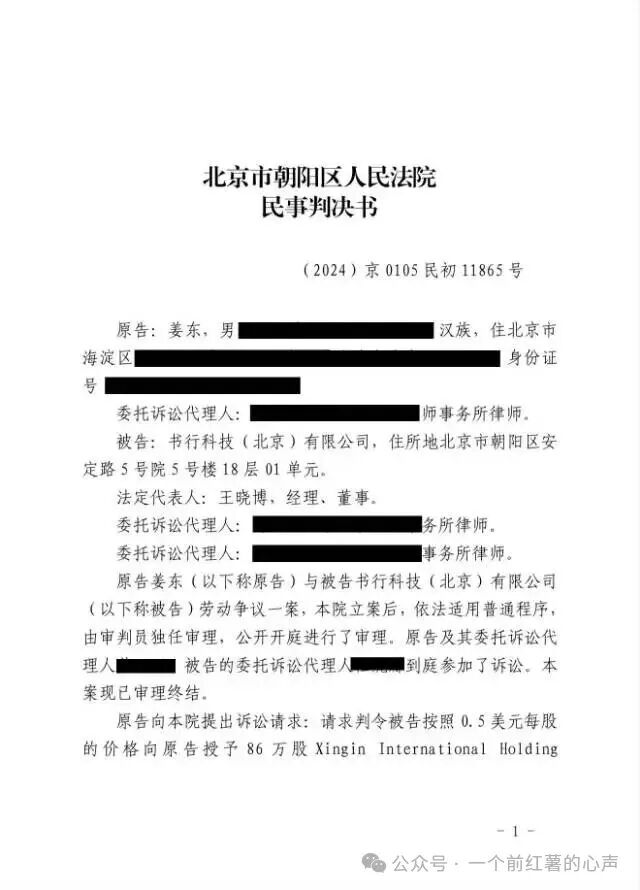
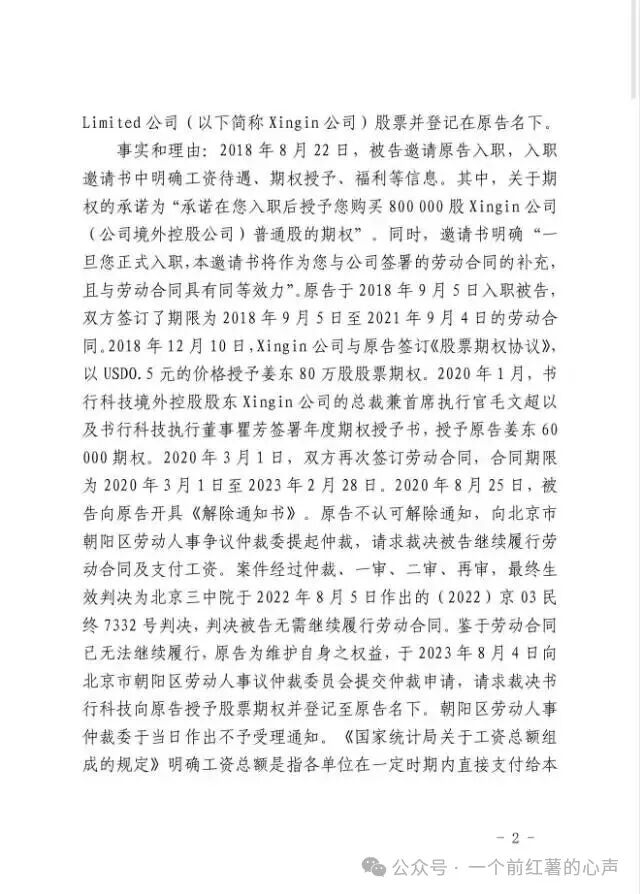
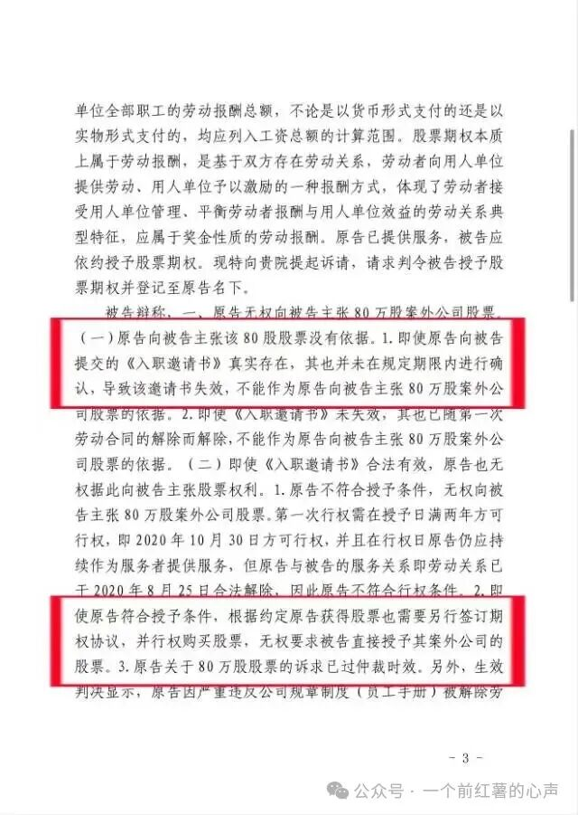
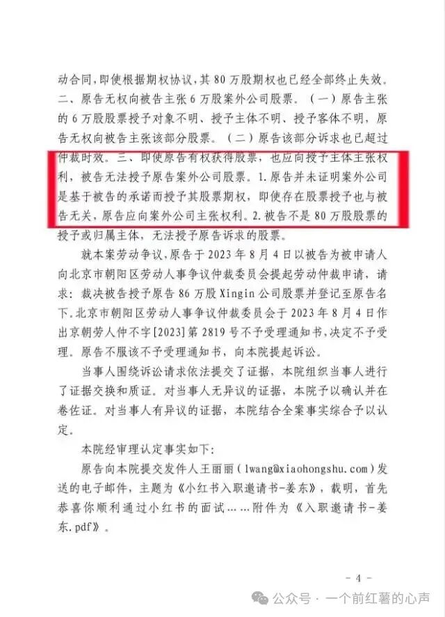
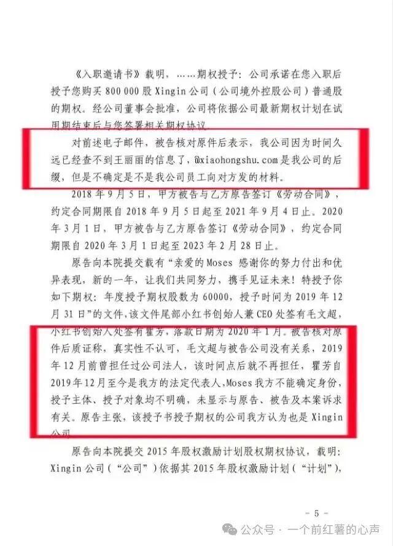
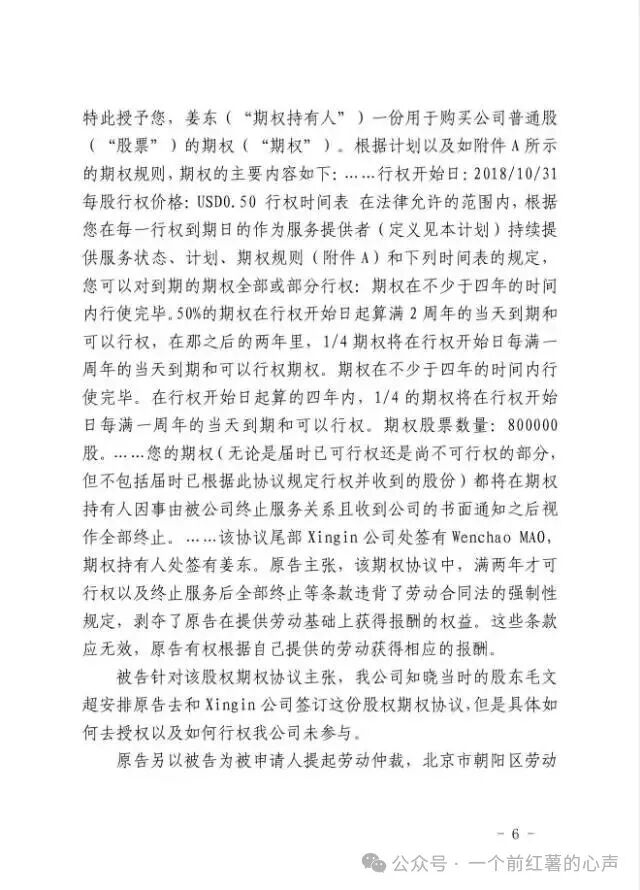
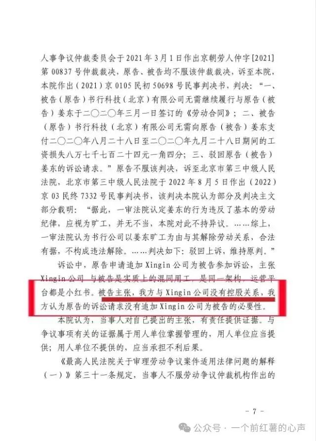
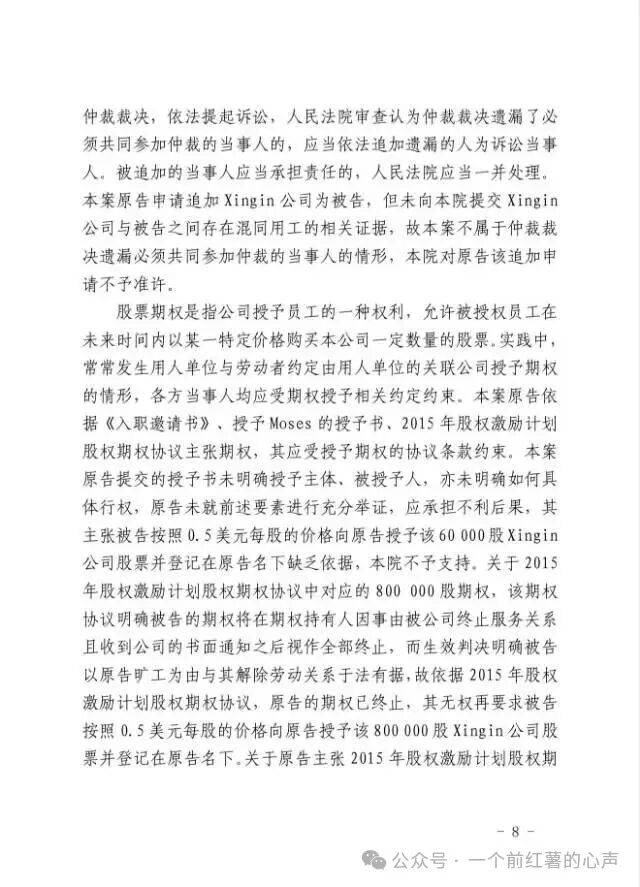
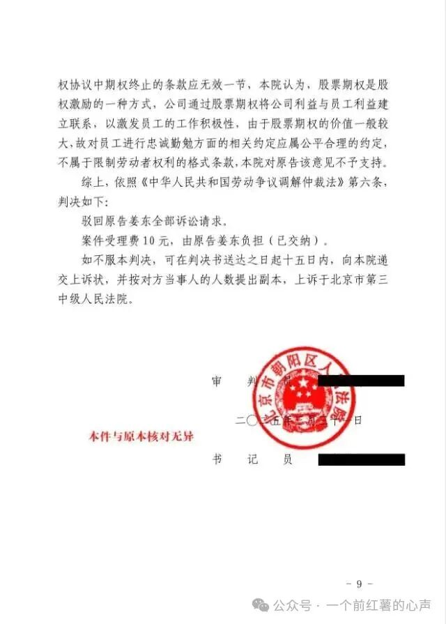
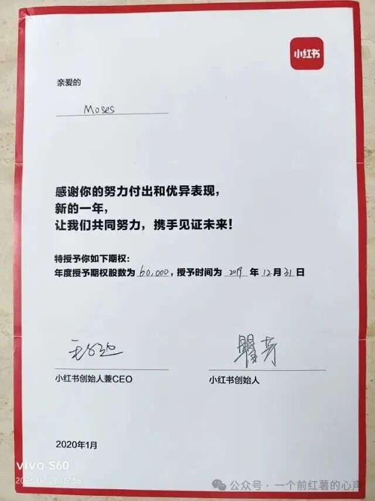

> ## 📄 授权收录声明
>
> **本文作者：姜东**（英文名 Moses，原小红书媒体智能团队负责人、首席技术专家）
> **首发于**：微信公众号「**一个前红薯的心声**」
> **原文链接**：https://mp.weixin.qq.com/s/mKd25Mu4ic9CLx4jfW4Z1w
>
> 本文经**作者本人授权**收录，全文完整转载，未作任何删改（仅将公众号排版转换为 Markdown 结构，并为原始材料图片补充了说明文字）。
>
> ⚠️ **著作权归姜东先生本人所有。本文不适用本仓库的 CC BY 4.0 许可** —— 如需转载请直接联系原作者。作者可在任何时间通知本仓库修改或删除。
>
> **文中所述为作者本人陈述**，其中诉讼结果部分有生效判决为据（案号：(2024)京 0105 民初 11865 号）；作者已公开表示尊重司法裁判结果，同时就四点疑问希望公司公开澄清。相关争议以司法结论为准。
>
> ← 返回 [案例索引](../README.md)

---

# 距期权归属仅剩8天被解除劳动合同‖我与小红书的真实诉讼记录
*首发于公众号「一个前红薯的心声」· 2026年7月27日 02:08*

---

我是姜东（英文名Moses，小红书内部薯名：大卫），原小红书媒体智能团队负责人。近期看到前同事陈浩分享的期权维权经历，深有共鸣。我与他既**有相似的期权争议背景，也存在不同细节。**
结合（2024）京 0105 民初 11865 号生效判决，鉴于案件庭审中出现的小红书抗辩理由与事实存在多处矛盾，相关主体至今尚未作出公开说明，我客观还原自身的所有经历，希望小红书能**正视期权激励相关争议，完善员工权益保障机制，并公开说明如下几点疑问。**
2018 年 9 月5日，我入职书行科技（北京）有限公司（即小红书），担任首席技术专家，后担任媒体智能团队负责人。
1、2018年8月：公司通过官方企业邮箱发送入职邀请书（即入职offer），承诺授予我境外 Xingin International Holding Limited（简称 Xingin 公司）80 万股期权，约定入职后签署期权协议，本人随后于9月5日入职小红书并签订劳动合同。
2、2018 年 12 月，我与 Xingin 公司签署期权协议，行权价格 0.5 美元 / 股，约定工作满 2 年可归属 50% 期权，协议由当时担任公司负责人的毛文超代表境外主体Xingin公司签字；
3、2020 年 1 月，我收到落款为“小红书创始人兼CEO毛文超、小红书创始人瞿芳”两人签字的年度期权授予文件，作为对2019年工作业绩的肯定，额外授予 6 万股期权；**在职期间合计对应 86 万股期权**。
4、2020 年 8 月 25 日，公司向我出具解除劳动合同通知书，**该解除时间距离我入职小红书满两年仅差 8 天**。后续我提起劳动仲裁、一审诉讼，主张书行科技应当兑现期权权益作为本人的劳动报酬收入。
庭审过程中，小红书提出三项与常识及公开信息存在明显冲突的抗辩：
1、主张境内主体书行科技与境外期权签约主体 Xingin 公司不存在控股关联，强烈反对追加境外主体作为共同被告；
2、不认可由毛文超、瞿芳共同署名的 6 万股年度期权授予文件效力；
3、针对官方后缀 @xiaohongshu.com企业邮箱发送的入职 Offer，以无法查询当年 HR 人员信息为由，对电子邮件内容不予认可。
最终法院依据期权协议条款及解除劳动合同的生效判决书，驳回我全部诉讼请求。**我完全尊重司法裁判结果**，但本人对小红书的抗辩理由存在明显疑问，我提出以下四点希望小红书公开澄清：
**1、境内书行科技与境外期权发放主体 Xingin International Holding Limited，二者是否存在控股关联？**
**2、2020 年 1 月授予我 6 万股期权的文件，落款签字人为毛文超、瞿芳，该文件对应的授予主体、授予对象分别是什么？两位公司创始人的签字是否具备承诺效力？**
**3、多起员工劳动争议中，劳动关系解除时间均临近期权关键归属节点，小红书能否公开说明人员优化、劳动关系解除的评判标准是什么？期权归属前解除劳动合同是否为惯常操作？**
**4、庭审中公司以无法核查当年 HR 信息为由，不认可 @xiaohongshu.com官方企业邮箱发出的入职邀约文件，那么小红书官方企业邮箱对外出具的书面文件，是否具备法律效力？若小红书上市，官方邮箱发布的内容是否值得信任？**
以上全部内容均来自本人持有的原始书面文件、法院生效判决书，真实还原劳动争议全过程，无捏造、夸大、恶意诋毁意图。希望小红书相关主体针对上述疑问作出公开回应。
以下为脱敏原始材料：
### 一、一审判决书

### 二、年度期权授予书
