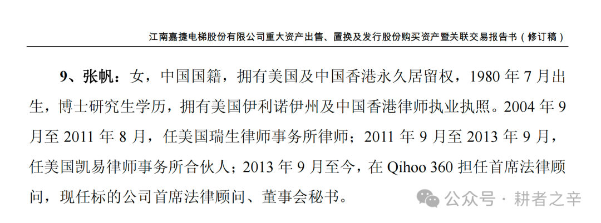
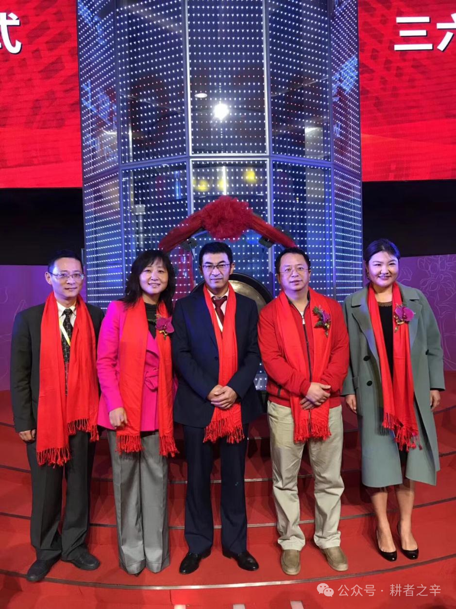

> ## 📄 授权收录声明
>
> **本文作者：张帆**（360 美股上市美国法律顾问，三六零回归 A 股后首任董事会秘书兼首席法律顾问）
> **首发于**：微信公众号「**耕者之辛**」
> **原文链接**：https://mp.weixin.qq.com/s/l5wBPut3HrLCC1SmTPkIwQ
>
> 本文经**作者本人书面授权**收录，全文完整转载，未作任何删改。
>
> ⚠️ **著作权归张帆女士本人所有。本文不适用本仓库的 CC BY 4.0 许可** —— 仓库的开放许可仅覆盖本项目自行撰写的内容。如需转载本文，请直接联系原作者获得授权。
>
> 作者可在任何时间通知本仓库修改或删除本文，我们将立即执行。
>
> **文中所述为作者本人陈述**；据媒体报道，三六零方面已于 2026 年 7 月 30 日作出回应。相关争议最终以司法、仲裁及监管结论为准。
>
> ← 返回 [案例索引](../README.md)

---

# 七年之辛：360首任董秘2600万维权实录一
> 公众号: 耕者之辛
> 发布时间: 2026年7月24日 00:34
> 原文链接: https://mp.weixin.qq.com/s/l5wBPut3HrLCC1SmTPkIwQ

---

我叫张帆，是360美股上市的美国法律顾问，也是三六零（股票代码：601360）回归A股上市的首任董事会秘书、首席法律顾问。作为一名资深国际律师，没想到我也不得不走上了向360集团公开维权的这条路。

我离开360集团七年了，公司还欠我两千多万元股权激励款项，到现在一分钱都没有支付。多年来我数次与360进行善意沟通，毫无效果，今年七月初，我抱着最后的希望给360集团实控人周鸿祎先生发微信，他看过之后，把我拉黑了。今天这篇文章，是我迈出公开维权的第一步。

注：引自2018年1月《江南嘉捷电梯股份有限公司重大资产出售、置换及发行股份购买资产暨关联交易报告书（修订稿）》第530页

2018年2月28日，360在上海证券交易所举行重组更名暨上市仪式，江南嘉捷正式更名为“三六零”，360从美国退市后回归A股借壳江南嘉捷上市正式取得成功。我站在照片右一位置。

一、获得360美股限制性股票及翻转

2013年加入360集团时，我获得了公司的限制性股票（RSU）。这是互联网大厂招募及吸引人才的通行做法：员工入职后，公司授予限制性股票或期权作为薪酬组成部分，双方约定得权期（vesting period）——员工持续服务满一定期限后，限制性股票或期权分期归属，员工据此享有相应股权权益。

2015年下半年，360启动美股私有化。私有化过程中，包括我在内的近两千名员工的未归属期权和限制性股票，按照私有化交易的法律安排，被"翻转"（rollover）至境内持股实体——天津奇睿众信科技合伙企业 (注：后更名为天津众信股权投资合伙企业，后又更名迁址为上海冠鹰企业管理合伙企业)，在三六零持股比例为2.82%。

这一翻转安排有明确的协议约定及美国证监会公开披露的法律文件备案：

2015年12月18日签署的《合并协议》(Agreement and Plan of Merger)明确规定，未归属期权及限制性股票"应自动且无需期权持有人采取任何行动地，通过Plan Vehicle转换为母公司的股权激励奖励，转换后的激励条款须实质相同，且不得减损持有人的经济利益"。周鸿祎先生以实际控制人身份向美国证券交易委员会（SEC）提交的SC13D/A文件也就同一事项做出了同样的承诺和披露。在两份法律文件中，Plan Vehicle均被明确定义为天津奇睿众信科技合伙企业。

2016年6月29日，360与员工在核聚MyCoreInfo系统线上签署《关于奇虎360集团员工股权激励事宜的确认函》，约定天津众信为原美股员工股票期权计划翻转后的境内持股实体，翻转后的权益依照原得权期继续正常得权，"不受私有化以及未来再次上市的影响"。

2016年7月13日，360的HR部门邮件确认共计1,956名员工签署了上述翻转权益的确认函，其中1,637名员工进行了线上签署，319名员工到期被系统视为自动确认签署，邮件抄送了保荐机构华泰联合证券。

2016年7月15日，360成功完成美股私有化的交割。

2018年10月14日，上海冠鹰向我出具《入资确认函》，书面确认我享有2,016,000股三六零股份的收益权。

根据美国证券法及美股360股权激励规则的约定，公司在私有化退市时，必须妥善处置员工的未归属期权权益——要么加速归属并兑付，要么承继翻转至新实体，同时保证员工原有权益不变，不存在"终止执行"的选项。这是Rule 13E-3对投资者权益保护的法定要求。若员工期权未得到依法处置，SEC有权不予批准私有化交割。

换言之，三六零在A股重组报告书中披露原美股员工股权激励计划"已全部停止执行"——如果该披露属实，即美股期权已被终止——那么360的私有化交易在美国证券监管框架下根本无法完成交割。

但美股私有化完成了，原员工期权没有被终止，而是统一被翻转到A股了，也后续被实际执行了 ——上海冠鹰在2021年清仓减持了全部三六零股票，并且已经向部分员工进行了兑付。

美股原股权激励翻转的法律文件清晰，交易安排规范，承诺内容明确，翻转本身后续也得到了实际的执行，但是在手握股权激励减持变现所得的20亿人民币之后，360公司的决策者有了别的想法。

二、我的讨薪过程

2013年至2019年，我作为首席法律顾问，深度参与了360的美股私有化、境内外重组和A股借壳上市的全过程，后兼任A股上市公司三六零的首任董事会秘书，压力大责任大，兢兢业业，不敢懈怠。2018年8月，我辞任上市公司董秘，2019年3月，我从360彻底离职了。离职时，我持有的2,016,000股股权激励权益，是公司对我六年工作的承诺和报酬的一部分，我本以为离职后公司会按约定正常兑付。

然而，离职七年了，平台减持五年了，一分钱也没有。

七年来，我多次通过当面交涉、书面催告、董秘转递、律师沟通等方式，试图与360妥善解决这个问题、维护我个人的合法权益。2026年初，360委托律师与我就具体金额、付款方式等进行商讨，但不知出于什么原因，360律师于5月初单方终止了沟通。

这些年来，出于善意和体面，我不想跟360和周鸿祎周总撕破脸闹不愉快，因为我和这家公司的渊源颇深，是有感情的。

2010年底，360在"3Q大战"正酣时启动美股上市，彼时我在瑞生（Latham & Watkins）的香港办公室工作，临危受命，担任360的美国律师（US issuer counsel），一字一句地撰写了招股书，通宵达旦与美国证监会沟通，以四个半月破纪录的速度完成了从申报到纽交所挂牌的全过程。2011年3月30日，360在纽交所敲钟上市。

上市后，360一直是我的客户。2011年我转到凯易（Kirkland & Ellis）做合伙人，360的项目仍由我负责。2013年，我决定接受360和周总的邀请，放弃凯易的合伙人身份，把家从香港搬到北京，全职加入360集团，担任首席法律顾问。

从外部律师到内部高管，从香港到北京，从律所合伙人到公司首席法律顾问——这个选择对我来说意味着很多。我相信360，相信周鸿祎周总，愿意把职业生涯最好的一段交付给这家公司。

2026年7月9日，我想做最后的善意努力，通过微信向周鸿祎先生发送了信息，想约周总聊聊，看到底问题出在哪。周总看过信息后一言不发地把我拉黑了。

对于这样的老东家——我帮它美股上市，帮它私有化，帮它回A股——九年的服务，七年的沟通，最终换来一条微信拉黑。

“悲愤交加，有辱斯文”，是当时涌上我心头的八个字。

三、迈出公开维权的第一步

2026年7月23日，我委托律师正式向三六零安全科技股份有限公司发出律师函。

律师函要求三六零：

1.  确认我持有2,016,000股A股股权激励权益的事实；

2.  向我支付股份处置收益人民币26,490,240元（按上海冠鹰减持均价13.14元/股计算），以及自2021年12月1日起至实际付清之日止的迟延付款利息；

3.  就延迟兑付七年期间的其他经济损失予以合理补偿。

律师函已通过电子邮件送达三六零实控人周鸿祎先生、胡欢女士、董事赵君先生、董事会审计委员会主席杨棉之先生、董事会秘书兼财务负责人张海龙先生、人力资源部门方雪娇女士，同时盖章原件已邮寄至三六零公司地址，张海龙代转董事会收。

韩愈说过："大凡物不得其平则鸣。人之于言也亦然，有不得已者而后言。"

我现在才真正理解这句话。

善意等不来结果，体面换不来尊重。

我选择公开，是希望能够在公众的视线下通过诉讼、仲裁、投诉等合法途径进行我的维权，个体对抗知名大厂，势单力薄，微弱的声音很容易被湮灭，希望在大家的目光注视下，我能够勇敢地捍卫自己的合法权益，不然自己都会瞧不起自己。

后续进展，我会在这里如实记录。