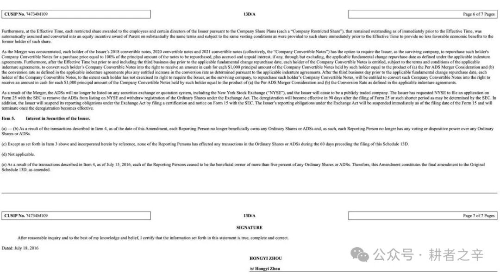
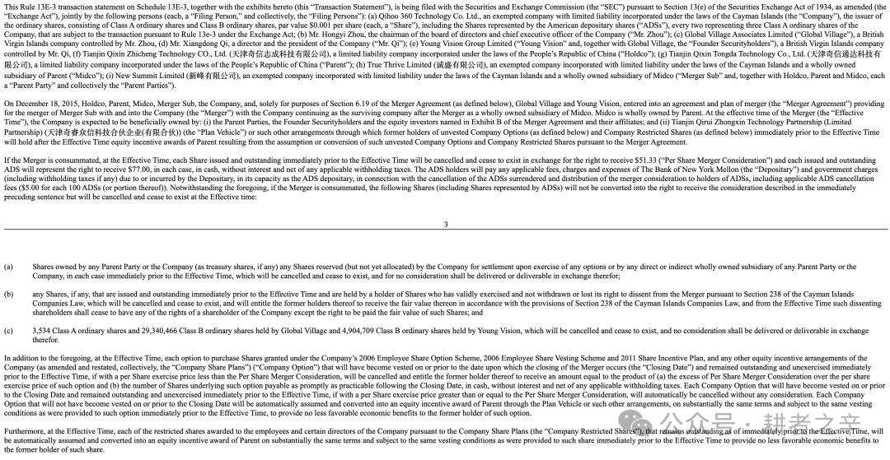

> ## 📄 授权收录声明
>
> **本文作者：张帆**（360 美股上市美国法律顾问，三六零回归 A 股后首任董事会秘书兼首席法律顾问）
> **首发于**：微信公众号「**耕者之辛**」· 本篇为「七年之辛」系列第二篇
> **原文链接**：https://mp.weixin.qq.com/s/788fXas11AOH-KbuIITBzA
>
> 本文经**作者本人书面授权**收录，全文完整转载，未作任何删改（仅将公众号排版转换为 Markdown 结构）。
>
> ⚠️ **著作权归张帆女士本人所有。本文不适用本仓库的 CC BY 4.0 许可** —— 如需转载请直接联系原作者。作者可在任何时间通知本仓库修改或删除。
>
> **文中所述为作者本人陈述与法律分析**；三六零方面已于 2026 年 7 月作出公开回应（本文亦对该回应作出回应）。相关争议最终以司法、仲裁及监管结论为准。
>
> ← 返回 [案例索引](../../README.md) · [第一篇](../)

---

# 七年之辛 (二)：20亿套现，360对美国说“翻了”，对中国说“没翻”
*首发于公众号「耕者之辛」· 2026年8月2日 00:29*

---

[第一篇文章](https://mp.weixin.qq.com/s?__biz=MzYzMjk5NjU3Mg==&mid=2247483666&idx=1&sn=2969f1df5262442d154aa0c203cfa973&scene=21#wechat_redirect)发出后这一周，很多事在发生，我也收到了很多支持——有身边的亲朋好友，有多年未见的老朋友，也有素未谋面的陌生人，每一条留言我都认真读了。当初公开发声时我做好了孤身维权的准备，现在知道自己不再一人独行了，谢谢大家。

“七年之辛”这个系列，我做好了写到第十集、第一百集的准备。维权需要多长时间，不由我决定——需要多久，就写多久。本来我没打算这么快更新第二篇，因为确实有大量的准备工作要做，但过去几天发生了两件事，让我觉得有必要此时写下这一篇。

7月29日，360集团通过媒体做了公开回应：“张帆女士本身就是专业律师，也深度参与，甚至主导了当时的交易结构和规则设计。她比谁都清楚该找谁主张权利、依据什么主张权利。”

很多网友也问我同一个问题：你本身就是律师，为什么不直接去起诉？

公司的“深度参与”四个字，确认了我是当年交易的重要内部知情人，我对此坦然接受。“主导”这个讲法我不认同。360当年近百亿美金的美股退市回归A股，是“中概股历史上规模最大的私有化交易”。我要是真能“主导”，何苦在交易完成、公司上市后几个月卸任董秘并旋即离职？又何苦事隔多年公开维权？20余亿的减持所得，是谁“主导”着分掉的？至于“她比谁都清楚该找谁主张权利”，是的，我确实清楚。

上一篇里，我简要讲述了360员工股权激励翻转的来龙去脉：2016年7月，360美股私有化完成之际，近两千名员工的未归属期权被“翻转”到境内持股实体天津奇睿众信（该主体后更名天津众信，再迁址更名上海冠鹰）。天津众信/上海冠鹰在360 A股上市前持有3%的股份，后经借壳稀释持有2.82%，2021年清仓减持套现超过20亿元。未来，希望有机会我能在合规前提下，完整拆解整套资本操作的步骤。

---

这里面最关键的一个事实问题，是美股360私有化时未归属的员工股权激励是否已以天津众信/上海冠鹰为持股平台翻转至A股360？

---

## 01 · 在美国SEC的承诺和披露

360和周鸿祎周总于2016年在美国证监会SEC所披露的文件，清晰地确认了：翻转了，而且必须翻转。这是周总签署并披露的Schedule 13D/A：

（原文链接：https://www.sec.gov/Archives/edgar/data/1508913/000114420416113276/v444249\_sc13da.htm）

截图的第一句话：

Furthermore, at the Effective Time, each restricted share awarded to the employees and certain directors of the Issuer pursuant to the Company Share Plans (each a “Company Restricted Share”), that remained outstanding as of immediately prior to the Effective Time, was automatically assumed and converted into an equity incentive award of Parent on substantially the same terms and subject to the same vesting conditions as were provided to such share immediately prior to the Effective Time to provide no less favorable economic benefits to the former holder of such share.

进一步（前段约定公司未归属期权的处理），于合并协议生效之时（即私有化完成时），凡依据本公司股权激励计划授予发行人员工及部分董事、且于合并生效前夕仍未行权 / 归属的每份限制性股票（下称 “本公司限制性股票”），均自动由母公司承接，并转换为母公司项下股权激励权益；转换后的激励权益，其条款、解锁条件与转换前限制性股份实质保持一致，且授予原持有人的经济待遇不得劣于转换前标准。

“Parent”母公司是谁？周总以上这一表述源自《合并协议》（Agreement and Plan of Merger，2015年12月18日签署）第3.1(f)条。所有主体的定义在《合并协议》、Schedule 13D/A、Schedule 13E-3中完全一致。我们看一下360、周总和全体买方团签署并披露的Schedule 13E-3：

（原文链接：https://www.sec.gov/Archives/edgar/data/1508913/000114420416074992/v428644\_sc13e3.htm）

截图第一段的披露，定义了私有化相关方的名称及简称：

This Rule 13E-3 transaction statement on Schedule 13E-3, together with the exhibits hereto (this “Transaction Statement”), is being filed with the Securities and Exchange Commission (the “SEC”) pursuant to Section 13(e) of the Securities Exchange Act of 1934, as amended (the “Exchange Act”), jointly by the following persons (each, a “Filing Person,” and collectively, the “Filing Persons”): ....; (g) Tianjin Qixin Tongda Technology Co., Ltd. (天津奇信通达科技有限公司), a limited liability company incorporated under the laws of the People’s Republic of China (“Parent”); (h) True Thrive Limited (诚盛有限公司), an exempted company incorporated with limited liability under the laws of the Cayman Islands and a wholly owned subsidiary of Parent (“Midco”); (i) New Summit Limited (新峰有限公司), an exempted company incorporated with limited liability under the laws of the Cayman Islands and a wholly owned subsidiary of Midco (“Merger Sub” and, together with Holdco, Parent and Midco, each a “Parent Party” and collectively the “Parent Parties”).

这段话清晰约定了“Parent”母公司就是中国公司天津奇信通达科技有限公司。

---

天津奇信通达科技有限公司是谁？它于2017年2月与天津奇思反向吸收合并，吸并后的公司，现在的全称是“三六零安全科技股份有限公司”，就是现在股票代码601360、简称“三六零”的A股360。

---

读到这里，大家已经不需要是美国证券法律专家，就能看明白一件事：在美股私有化阶段，360和周总面对广大360员工、买方团、多方法律顾问、美国证监会，做出了郑重承诺——未归属期权必须翻转。如果我有更长的篇幅，可以细致阅读《合并协议》的相关约定，比如协议第3.1(f)条规定，员工未归属的期权和限制性股票“will be assumed and converted into an equity incentive award of Parent through (the Plan Vehicle)... on substantially the same terms and subject to the same vesting conditions”——自动转换为母公司的股权激励，条款实质相同，归属条件不变。Plan Vehicle 持股平台，即前述天津众信/上海冠鹰。

SEC文件白纸黑字：翻转了。

## 02 · 在国内的说法

我们已知，360在A股重组报告书中披露原美股员工股权激励计划“已全部停止执行”。接下来，我们看一下在面对前高管基于美股员工股权激励翻转的诉讼中，360的说法和法院的判决。

媒体公开报道显示，在我之前，已经有四位360前高管起诉过了。温跃宇，360前高管，持有2,574,768股，2023年在上海起诉上海冠鹰，一审败诉，二审维持原判。李旺，原360集团副总裁，起诉后一审败诉。还有两位前副总裁，一人败诉，一人的起诉彼时甚至没有被受理。

基于360的抗辩，从前述案件的公开信息来看，法院认为：美股限制性股票纠纷不属于本案审理范围，相关协议约定境外仲裁管辖，原告可另行依据境外协议维权；美股360、A 股三六零为相互独立法人，股权转换必须具备完整法定书面文件，无公告股权激励方案、无官方转换协议，仅凭《入资确认函》无法认定美股期权自动转为上海冠鹰持有的 A 股收益权。换言之，法院列出的每一项理由，都是程序和证据层面的——翻转到底有没有发生，始终没有被回答。

A股说没翻。法院说管不了。

## 03 · 半张图和另外半张图

现在大家慢慢拥有了“上帝视角”，看到了360和周总在美股私有化时的承诺和披露，看到了在A股重组报告书里的披露，看到了360在中国法院的辩称。同一个事实，截然相反的两个说法。

法院仅单独审查《入资确认函》是否满足入伙条件。至于美股期权翻转的完整链条——SEC披露的《合并协议》和Schedule 13E-3、1,956人签署的翻转确认函——“不属于本案审理范围”。证据链被截成了两段，原告都输在这“半张图”上。企业赢，并非法理占优，是因为法官只看到了企业想让法官看到的那一半。这套裁判逻辑，也是绝大多数红筹企业持股员工维权的核心壁垒。

我不是不起诉，是不能在对方画好的半张图里起诉。先把全图拼出来，摆在所有人面前。

还有几个问题，不在法院审理判决的视线范围内：

1

若上海冠鹰并非私有化约定的员工股权激励平移载体，其持有的 190,878,127股占比2.82%的三六零股份来源是什么？是否和买方团股东支付了同等对价？

2

私有化时近两千员工统一签署的《翻转确认函》是否真实存在？最核心的翻转确认文件留存于核聚股权管理系统——面对司法调查与监管，核聚能否完整调取并提交当年系统上所有360员工的数据与文件？为何多起诉讼中企业始终不予出示？

3

上海冠鹰无强制入伙出资要求，却向众多员工出具载明精确持股数额的《入资确认函》，出具授权主体是谁，合计开具多少份，名单是否匹配当年美股激励持有人？

这些问题的答案，不止关系到我一个人的两千多万。

## 04 · 不止是我

无论是过去、现在还是未来，股权激励从来不是什么灰色地带的边缘安排。国家鼓励大众创业、万众创新，股权激励正是承载这一战略的制度工具——让智力、技术与管理的价值获得合理回报，让人才与企业形成真正的利益共同体。方向始终清晰，只是出了事怎么办，规则还没来得及完全跟上。

过去二十年，一批又一批中国互联网公司、科技企业赴境外上市，用的都是红筹架构：员工的劳动和服务在中国境内，股权激励却挂在开曼群岛的境外主体上。平时相安无事，一旦出了纠纷，境内说授予主体在境外你找境外去，境外说管辖成本律师费用你自己掂量。跨境，即截断——员工掉进了“境内服务、境外授予、出事两头不管”的那道沟里。掉进这道沟的，不止360的四位前高管和我。

但这道沟，正在被收拢。今年4月，北京市第三中级人民法院在一份生效终审判决中明确：招聘时把股票激励作为薪酬总包的固定组成部分，就构成劳动报酬的合意；哪怕授予协议的签署方是关联公司而非用人单位本身，只要用人单位是实质受益者，就须承担责任。而在另一份涉及VIE架构的判决中【(2025)京03民终7995号】，该院进一步明确：哪怕授予方是境外关联公司，境内用人单位仍须为其关联方授予员工的股权激励承担兑付责任。今年7月24日，财政部和税务总局发布第21号公告，对离岸信托实施全生命周期的穿透式征税。

7月24日——正好是我发出《七年之辛》第一篇的那一天。可以把这当作一个巧合，也当作一个注脚：离岸架构可以被层层穿透的时代，已经来了。

“开曼360不是A股360”的说法，不仅在法律和监管面前站不住脚，而且是逆势而为。

前半生我规规矩矩，好学生，好律师，好员工，此番公开维权，是这辈子干的最出圈破格的事，但也由此打开了新世界的大门，结识了众多的高手和有识之士。今天文章的结尾，引自“个人公众号：梅落读书” ：

很多人以为法治是宏大的顶层叙事，离普通人的生活很远。事实上，法治从不局限于宏观制度，而是蕴藏在普通人的每一次较真与坚守之中。职场法治化的进步，从来不是自上而下的被动馈赠，而是无数劳动者依规维权、拒绝妥协，一点点打磨推进的结果。

下一集见。